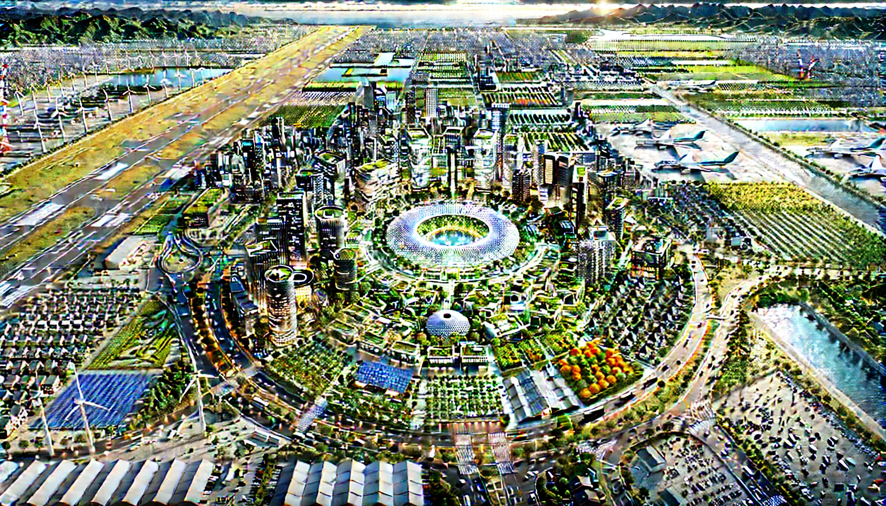
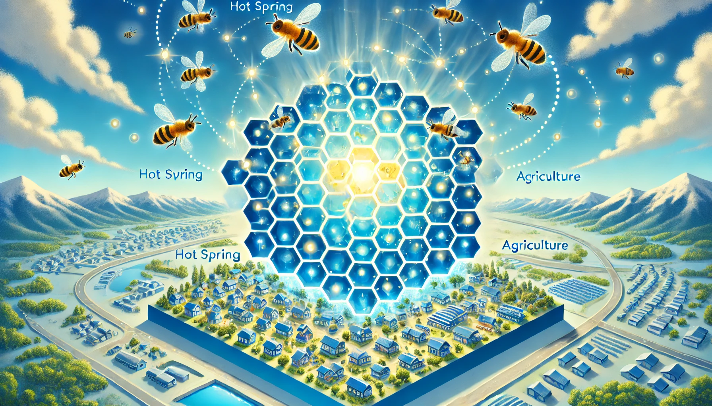

# Small-HappyCity
30万人規模の地方中核都市で、デジタル活用による経済的持続性を重視したWell-Beingなまちづくりプロジェクト

日本の人口減少社会において、10-30万人規模の地方中核都市を周囲の自治体とが協力して、持続可能性と住民の幸福度を両立させる革新的なまちづくりが必要とされる  
・中核都市が実現するデジタル民主主義  
・小さな都市からゆっくりと集約を行う戦略的縮小モデル  
・多くの住民が目指すウェルビーイング指標の統合  
によって、従来の成長モデルから脱却した新しい都市経営を行う

世界に先駆けて自然な街の集約を実現するモデルケースとして発信したい

例）霧島セントラルシティー  
霧島周辺の自治体が協力し、新しい中核の街を作る  

例）戦略的縮小のイメージ  
周囲の町から自然に霧島セントラルシティへ住民が集まってくるイメージ

